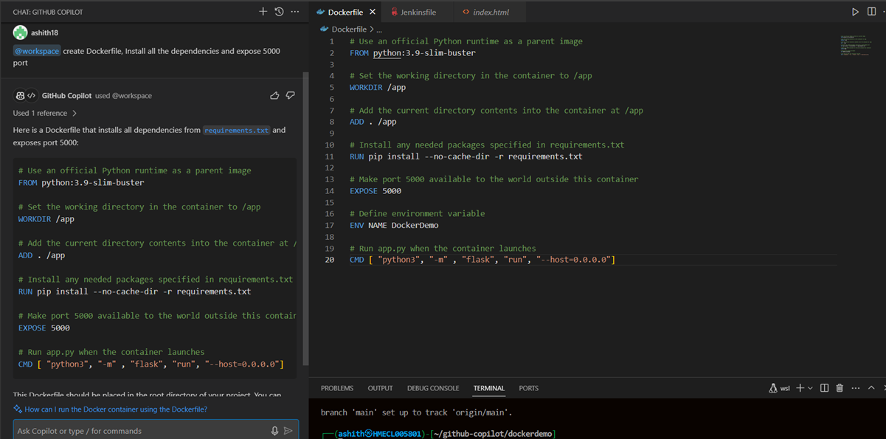
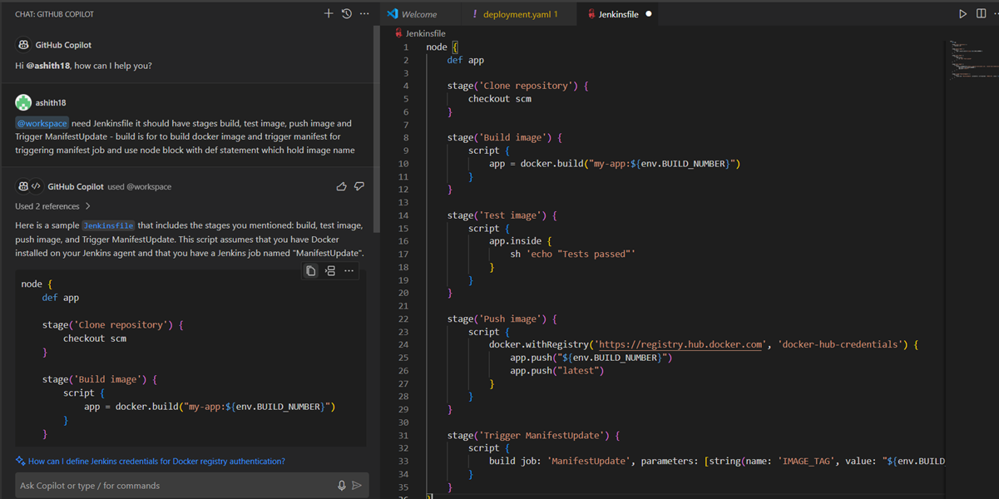
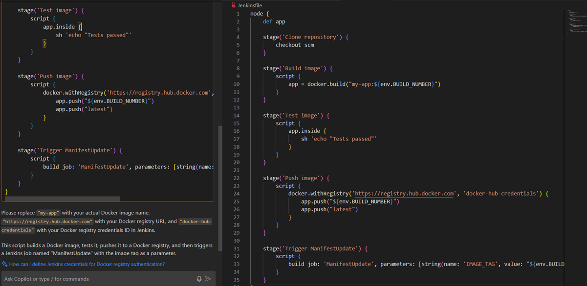

# Python Flask Application

This repository contains a Python Flask application, along with a Dockerfile and a Jenkinsfile for building and deploying the application using Docker and Jenkins.

## Overview

- **Flask Application**: A Python Flask web application that provides a simple API or web interface.
- **Dockerfile**: A Docker configuration file used to build a Docker image for the Flask application.
- **Jenkinsfile**: A Jenkins pipeline script that automates the build, test, and deployment processes for the Flask application using Docker.

## Prerequisites

- Docker
- Jenkins
- GitHub Copilot (for generating the Dockerfile and Jenkinsfile)

The Flask application should now be accessible at `http://localhost:5000`.

## Continuous Integration and Deployment

This project uses Jenkins for Continuous Integration and Deployment (CI/CD). The `Jenkinsfile` was generated by GitHub Copilot and defines the pipeline stages for building, testing, and deploying the Flask application using Docker.

1. Set up Jenkins and configure it to use this repository.
2. Create a new Jenkins pipeline job and point it to the `Jenkinsfile` in this repository.
3. Configure any necessary environment variables or credentials required by the pipeline.
4. Run the Jenkins job to trigger the CI/CD pipeline.

# To test docker image

1. git clone http://gitlab.10.16.85.156.nip.io/devops-solutions/dockerdemo.git
2. cd dockerdemo
3. docker build -t flaskApp:latest .
4. docker run --name FlaskApp -it -p 5000:5000 -d flaskApp:latest
5. curl localhost:5000

# Screenshots - GitHub Copilot

